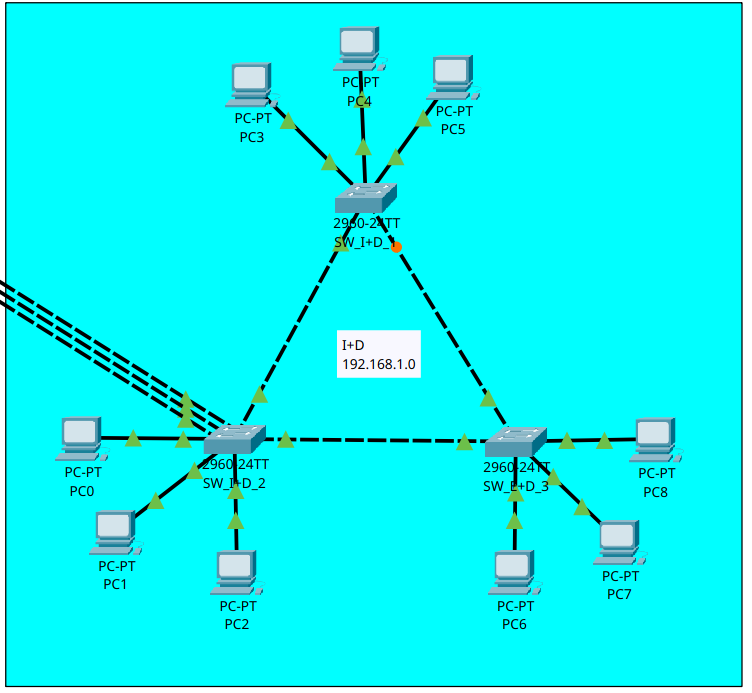
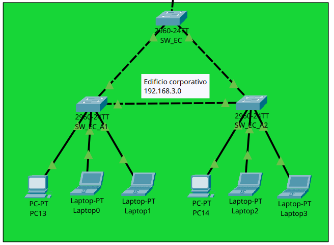
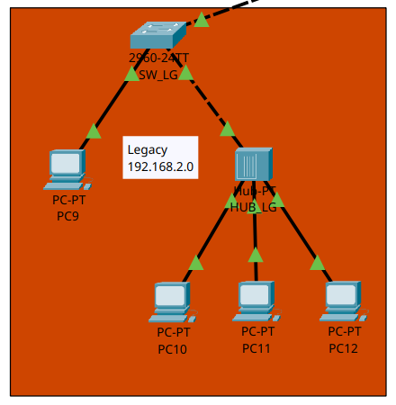
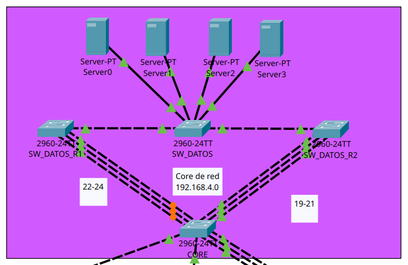

# Smartcity Tech Park

## Implementación
La solución implementada para *Smartcity tech park* fue una topología jerárquica de red formada alrededor de un switch **core** ubicado en el centro de datos. Este cumple el papel central de interconexión entre las áreas del edificio y permite la administración de distintas redes VLAN por medio de VTP.

El diseño se divide en cuatro áreas principales: Centro de Datos, Centro de I+D, Edificio Corporativo y Planta de Producción. Cada área posee una función específica dentro de la infraestructura.

La solución también incorpora mecanismos de redundancia mediante EtherChannel y STP, permitiendo mantener la conectividad ante determinadas fallas de enlaces o dispositivos.

El Edificio Corporativo se encuentra dividido en dos alas, cada una con su correspondiente switch de acceso. Además, se implementó una VLAN independiente para visitantes, destinada a los dispositivos inalámbricos conectados mediante un Access Point.

Finalmente, la Planta de Producción conserva un segmento Legacy basado en un Hub. Este segmento representa un dominio de colisión compartido de Capa 1 y se integra a la red mediante un switch de acceso, permitiendo mantener la compatibilidad con los equipos industriales antiguos.

## VTP
Para facilitar la administración y distribución de las VLAN se implementó VTP.

El dominio VTP utilizado en la infraestructura es:
- Dominio: Smart_2
- Contraseña: proyecto12S2026

Server, siendo responsable de la creación y administración de las VLAN de las oficinas.

Los switches que requieren recibir la información de las VLAN utilizan el modo VTP correspondiente a su función dentro de la topología. Los enlaces entre estos dispositivos se configuraron como enlaces troncales para permitir el transporte de múltiples VLAN.

Las VLAN administradas mediante el dominio son:

- VLAN 19 - GERENCIA
- VLAN 29 - INVESTIGACION
- VLAN 39 - PRODUCCION
- VLAN 49 - SERVIDORES
- VLAN 59 - VISITANTES

La VLAN 99 se utiliza como VLAN nativa de los enlaces troncales.

## EtherChannel
Para aumentar la capacidad de determinados enlaces y proporcionar redundancia física se implementó EtherChannel en los segmentos donde el diseño requiere múltiples enlaces entre dispositivos. Especificamente se seleccionó el protocolo **LACP**.

La utilización de EtherChannel permite agrupar varios enlaces físicos en un único enlace lógico. De esta forma, los enlaces agrupados pueden ser utilizados conjuntamente para transportar tráfico y proporcionar redundancia ante la falla de uno de los enlaces físicos.

Esta implementación es especialmente relevante en los segmentos que concentran un mayor volumen de tráfico o que requieren mayor disponibilidad, evitando depender de un único enlace físico, especificamente en el área de I+D y el área de servidores.

## STP

Para prevenir la formación de bucles de Capa 2 se implementó Rapid-PVST.

Rapid-PVST permite mantener una instancia de Spanning Tree independiente para cada VLAN, proporcionando control sobre la selección del Root Bridge y permitiendo optimizar el camino utilizado por cada segmento de la red.

La configuración de STP también proporciona redundancia, ya que los enlaces alternativos pueden permanecer disponibles mientras STP evita que formen bucles. Ante una falla, estos caminos pueden ser habilitados nuevamente por el protocolo.

## Ubicaciones

### I+D

El Centro de I+D fue diseñado considerando la necesidad de mantener la conectividad ante la falla de cualquiera de sus switches.

Para cumplir este requerimiento se utilizan al menos tres switches interconectados entre sí, formando una estructura redundante. La existencia de múltiples caminos permite que la falla de uno de los dispositivos no provoque el aislamiento completo del resto del segmento.

Los enlaces redundantes son administrados mediante Rapid-PVST, que determina qué caminos permanecen activos y cuáles se mantienen en estado de respaldo para evitar bucles de Capa 2.

Adicionalmente, la conexión del Centro de I+D hacia el Centro de Datos posee una capacidad superior a la de los enlaces troncales convencionales del campus, debido a la mayor demanda de tráfico esperada en esta área.

### Edificio corporativo

El Edificio Corporativo se encuentra dividido en dos alas físicas, cada una equipada con un switch de acceso.

La interconexión entre ambas alas se diseñó de manera redundante, permitiendo conservar la comunicación entre los switches de acceso incluso cuando una de las rutas hacia el switch de distribución correspondiente deja de estar disponible.

El segmento administrativo utiliza la VLAN 19, denominada `GERENCIA`, mientras que para los visitantes se implementó la VLAN 59, denominada `VISITANTES`, permitiendo mantener dominios de broadcast independientes y facilita la aplicación de políticas de seguridad y administración diferenciadas para los usuarios administrativos y visitantes.

### Plante de producción y Legacy
La Planta de Producción mantiene un segmento Legacy debido a la existencia de maquinaria y protocolos antiguos que no pueden ser migrados inmediatamente hacia infraestructura de conmutación moderna.

Para representar esta condición se implementó un Hub conectado a un switch de acceso. Las máquinas industriales conectadas al Hub comparten el mismo dominio de colisión.

A diferencia de un switch, el Hub opera en Capa 1 y replica las señales recibidas hacia los demás puertos. Por esta razón, los dispositivos conectados al Hub comparten el medio de transmisión y pueden producir colisiones cuando varios dispositivos intentan transmitir simultáneamente.

### Centro de datos y servidores
El Centro de Datos constituye el núcleo de la infraestructura de red. El switch central proporciona la interconexión entre los diferentes edificios y concentra la administración de las VLAN mediante VTP.

Los servidores críticos de la empresa se encuentran agrupados en la VLAN 49, denominada SERVIDORES.

Debido a que el Centro de Datos concentra tráfico proveniente de las diferentes áreas del campus, sus enlaces fueron diseñados considerando los requerimientos de ancho de banda y disponibilidad de la infraestructura.

La conexión de los servidores utiliza mecanismos de redundancia cuando son requeridos por el diseño, evitando que una única conexión física represente un punto único de falla para los servicios críticos.

Los enlaces hacia los demás edificios se configuran como troncales, permitiendo transportar las VLAN requeridas entre el núcleo y las diferentes áreas de la organización.

## Medios de transmisión

La selección del medio de transmisión dependió fuertemente  de la propia naturaleza del proyecto, debido a la utilización de únicamente switches se optó por la utilización de cableado de cobre Ethernet.

## Seguridad básica
Como medida básica de seguridad se configuró un banner MOTD en los switches de distribución de la infraestructura.

El mensaje utilizado sigue el formato establecido en los requerimientos:

Acceso Restringido - TechPark_202300629

Esta configuración permite mostrar un aviso de acceso restringido cada vez que un usuario accede al dispositivo.

También se modificó la VLAN nativa de los enlaces troncales del campus. En lugar de utilizar la VLAN 1 predeterminada, se configuró la VLAN 99 como VLAN nativa.

El cambio permite separar la VLAN nativa de las VLAN de usuarios y servidores utilizadas normalmente en la infraestructura y evita depender de la VLAN 1 para el funcionamiento de los enlaces troncales.

## Presupuesto
| Objeto | Costo(USD) | Cantidad | Total |
| :---: | :---: | :---: | :---: |
| Servidor | 2000 | 5 | 10000 |
| Pc | 1000 | 15 | 15000 |
| Laptop | 1000 | 4 | 4000 |
| Switch | 150 | 11 | 1650 | 
| Hub | 100 | 1 | 100 |
| Total |  | | 27150 | 

## Dominios de colision
| Dispositivo| Puertos activos | Dominios de colisión | Descripción|
| --- | ---: | ---: | --- |
| Switch Core               | X | X | Cada puerto activo constituye un dominio de colisión independiente|
| Switch Distribución I+D 1 | 5 | X | Un dominio por cada enlace activo|
| Switch Distribución I+D 2 | 8 | X | Un dominio por cada enlace activo|
| Switch Distribución I+D 3 | 5 | X | Un dominio por cada enlace activo|
| Switch Corporativo Ala 1  | 5 | X | Un dominio por cada puerto activo|
| Switch Corporativo Ala 2  | 5 | X | Un dominio por cada puerto activo|
| Switch Producción         | 3 | X | El puerto conectado al Hub constituye el segmento hacia Legacy|
| Hub Legacy                | 4 | 1 compartido | Todos los equipos conectados al Hub comparten el mismo dominio de colisión |
